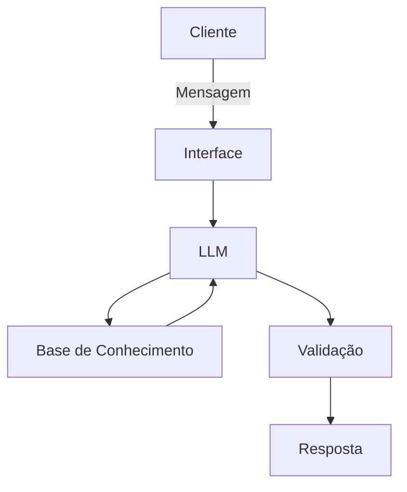

# 🤖 Optimus: Analista Financeiro Geopolítico

O **Optimus** é um agente de inteligência artificial proativo projetado para ajudar investidores a entenderem o impacto de eventos geopolíticos e notícias macroeconômicas em seus portfólios. Diferente de chatbots reativos, o Optimus cruza notícias em tempo real com uma base histórica de conflitos e indicadores macro para sugerir alocações táticas.

## 🎯 Caso de Uso
* **Problema**: Investidores acompanham as notícias, mas não sabem como elas impactam a economia global e seus investimentos na prática.
* **Solução**: O usuário cita uma notícia e o assistente avalia como a economia é impactada, recomendando áreas para investimento com base em dados históricos.
* **Público-Alvo**: Investidores que buscam uma avaliação técnica da economia mediante acontecimentos específicos.

## 🏗️ Arquitetura do Sistema
O projeto utiliza uma estrutura local e eficiente para processamento:
* **Interface**: Chatbot interativo desenvolvido em **Streamlit**.
* **Cérebro (LLM)**: **Ollama** executando o modelo `llama3.2:1b`.
* **Base de Conhecimento**: Integração de dados via JSON e CSV contendo perfis de clientes e indicadores de mercado.



🛠️ Tecnologias Utilizadas

- **Linguagem:** Python
- **Bibliotecas:** Pandas, Streamlit e Requests
- **Orquestração:** Ollama

---

📊 Base de Dados (RAG)

O agente fundamenta as suas análises nos seguintes módulos:

- `optimus_indicadores_macro.csv`: 12 indicadores (VIX, DXY, CPI, Fed Rate, etc.) com direção e impacto por classe de ativo.
- `optimus_historico_eventos.csv`: Dados de 10 eventos geopolíticos reais (2014–2024) e as suas variações no S&P 500.
- `optimus_setores.json`: Mapeamento de setores como Defesa, Energia e Tecnologia com correlação a conflitos.
- `optimus_perfil_investidor.json`: Perfil personalizado do usuário com metas e tolerância a risco.

---

🚀 Como Executar

**1. Configurar o Ollama:**
```bash
ollama pull llama3.2:1b
ollama serve
```

**2. Instalar Dependências:**
```bash
pip install streamlit pandas requests
```

**3. Rodar a Aplicação:**
```bash
streamlit run ./src/app.py
```

---

🛡️ Segurança e Anti-Alucinação

- **Base de Dados:** O agente responde estritamente com base nos dados fornecidos.
- **Transparência:** Admite limitações quando não encontra informações específicas.
- **Ética:** Não recomenda empresas específicas, apenas setores que podem se beneficiar do cenário.
- **Validação:** Checagem de alucinações integrada no fluxo de resposta.
