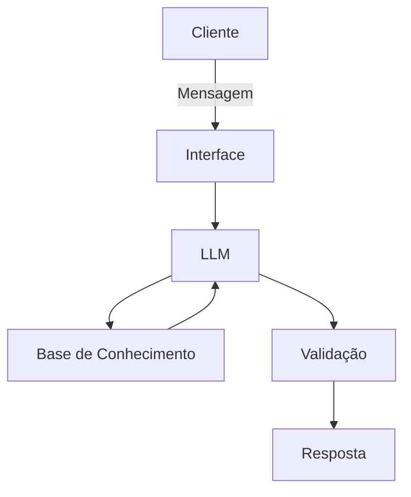

# Documentação do Agente

## Caso de Uso

### Problema
> Qual problema financeiro seu agente resolve?
Investidores veêm as notícias, mas não sabem como isso impacta a economia global
> 
### Solução
> Como o agente resolve esse problema de forma proativa?
O usuário cita a notícia e o assistente avalia como a economia é impactada.
> 
### Público-Alvo
> Quem vai usar esse agente?
Iniciantes no mercado financeiro que desejam saber em quais áreas investir
---

## Persona e Tom de Voz

### Nome do Agente
Optimus

### Personalidade
> Como o agente se comporta? (ex: consultivo, direto, educativo)
Analísta e sugestivo

### Tom de Comunicação
> Formal, informal, técnico, acessível?
Técnico

### Exemplos de Linguagem
- Saudação: Olá! Como posso te ajudar hoje?
- Confirmação: Um momento... Vou buscar informação
- Erro/Limitação: Não tenho acesso a essa informação no momento, mas aqui está um resultado semelhante...

---

## Arquitetura

### Diagrama

### Componentes

| Componente | Descrição |
|------------|-----------|
| Interface | Chatbot em Streamlit
| LLM | Ollama via LFM2 
| Base de Conhecimento | JSON/CSV com dados do cliente e notícias fornecidas pelo user
| Validação | Checagem de alucinações

---

## Segurança e Anti-Alucinação

### Estratégias Adotadas

- [ ] Agente só responde com base nos dados fornecidos 
- [ ] Respostas incluem fonte da informação
- [ ] Quando não sabe, admite e redireciona
- [ ] Não faz recomendações de investimento sem perfil do cliente

### Limitações Declaradas
> O que o agente NÃO faz?

Recomendações de empresas
